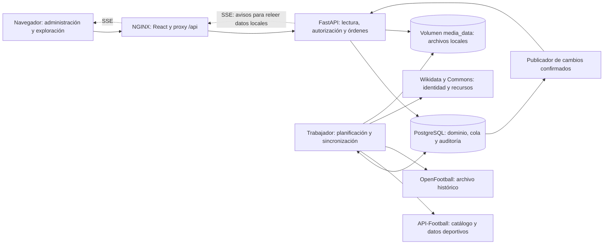
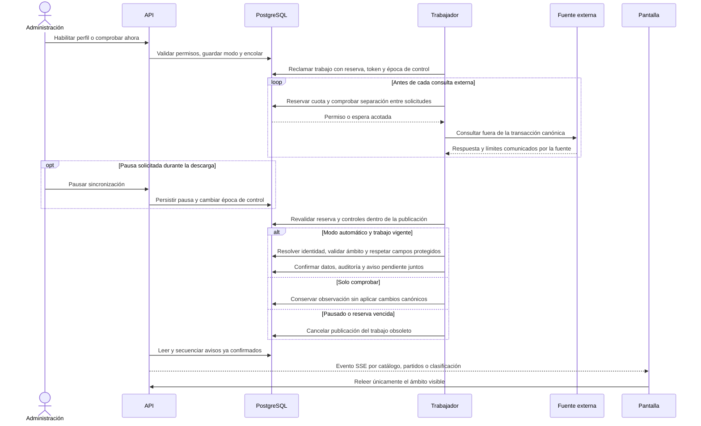

# Arquitectura de ONCE

> ONCE organiza información de fútbol: identidades, competiciones, ediciones, partidos, estadísticas y procedencia. Este documento describe el código existente; las posibilidades futuras se identifican expresamente como propuestas.

[Inicio](README.md) · [Contexto](CONTEXT.md) · [Instalación](SETUP.md) · [Pruebas](TESTING.md) · [Despliegue](DEPLOYMENT.md) · [Diagnóstico](TROUBLESHOOTING.md) · [Contribuir](CONTRIBUTING.md)

## 1. Forma del sistema

ONCE es un **monolito modular con dos procesos de backend**: una API atiende usuarios y un trabajador ejecuta importaciones. Ambos comparten modelos, reglas y PostgreSQL. La interfaz React se compila por separado y NGINX sirve sus archivos y dirige `/api` al backend.

La separación resuelve una necesidad concreta: abrir un partido consulta la copia local; no dispara una solicitud a API-Football. El trabajador puede esperar una cuota, una dependencia o una fuente sin retener la petición del visitante. Las operaciones administrativas de comprobación externa son acciones explícitas y autorizadas.

SQLModel participa en persistencia y validación, y los servicios reciben sesiones SQLAlchemy. Hay límites por responsabilidad, pero no una implementación estricta de arquitectura hexagonal ni repositorios abstractos para cada tabla. Tampoco existen Redis, Celery, Kafka o Kubernetes en el despliegue actual.

Esta es la justificación del diseño que existe, no la reconstrucción de una evaluación histórica ni una ventaja universal de estas herramientas:

| Elección | Qué resuelve hoy | Coste o límite que se acepta |
| --- | --- | --- |
| FastAPI y Python | Validación tipada, contratos HTTP/OpenAPI y reutilización de reglas con los adaptadores | El trabajo pesado y la E/S de proveedores requieren presupuesto y separación del recorrido HTTP |
| PostgreSQL | Relaciones deportivas, auditoría y publicación de trabajos dentro de transacciones coordinadas | Concentra persistencia y coordinación; exige vigilar bloqueos, conexiones y recuperación |
| Monolito modular + trabajador | Comparte dominio y despliegue, mientras las esperas externas ocurren en otro proceso | Las versiones y migraciones siguen coordinadas; no proporciona disponibilidad independiente de cada módulo |
| React y Vite | Componentes reutilizables para administración/exploración, carga diferida y actualización de vistas | Añade compilación y estado de cliente; accesibilidad, tamaños y cancelación de peticiones deben probarse |
| Docker Compose | Describe servicios, red, dependencias y volúmenes en una instalación portable | El despliegue actual depende de un anfitrión; los volúmenes necesitan copia y las etiquetas móviles, revisión |
| Cola y caché PostgreSQL, sin Redis/Celery | Reutiliza el almacenamiento que ya permite reservas, cuotas y pausas durables | El proyecto mantiene su propio motor; una necesidad medida de colas especializadas justificaría reevaluarlo |
| Módulos, sin microservicios | Mantiene juntas las reglas que necesitan consistencia entre identidad, partido, tabla y auditoría | Una separación futura necesita límites de propiedad y carga claros, además de contratos y operación adicionales |

### Versiones y reproducibilidad

| Pieza | Referencia comprobable | Uso |
| --- | --- | --- |
| Python | `python:3.12-slim`; parche no fijado | API, trabajador y utilidades |
| FastAPI / Uvicorn | `0.141.1` / `0.52.4` en `requirements.txt` | HTTP y servidor ASGI |
| SQLModel / SQLAlchemy | `0.0.42` / `2.0.52` | Modelos, consultas y transacciones |
| Alembic | `1.20.0` | Evolución del esquema |
| PostgreSQL | `postgres:15-alpine`; parche no fijado | Datos canónicos y operación durable |
| React / React DOM | Rango `^19.2.8`; lock resuelto a `19.3.0` | Administración y experiencia pública |
| Vite / Node.js | `8.3.0` en lock / `node:24-alpine` | Desarrollo y compilación del frontend |
| NGINX | `nginx:alpine`; versión y digest no fijados | Estáticos, proxy y SSE |

Las dependencias Python tienen versiones exactas; `npm ci` usa `frontend/package-lock.json`. Las etiquetas de imágenes son móviles: una reconstrucción futura puede recibir otro parche de sistema. Fijar imágenes por digest es una mejora posible, no una garantía ya implantada.

## 2. Componentes y despliegue



| Servicio Compose | Responsabilidad | Exposición y recursos configurados |
| --- | --- | --- |
| `db` | PostgreSQL 15 | Sin puerto publicado; volumen `postgres_data` |
| `api` | Migraciones al arrancar, API y medios | `127.0.0.1:8000`; límite 768 MiB y 2 CPU |
| `worker` | Trabajos, cuotas, recuperación y retención | Sin puerto; límite 512 MiB y 1 CPU |
| `frontend` | NGINX y React compilado | `FRONTEND_BIND:FRONTEND_PORT`, por defecto `127.0.0.1:80` |
| `pgadmin` | Herramienta opcional, perfil `admin` | `127.0.0.1:5050`; no forma parte del arranque habitual |

`api` y `worker` usan la imagen local `vertice-api` y comparten `media_data`. El trabajador espera a que la API esté saludable; esta espera a PostgreSQL. Las cuotas de CPU/memoria son límites configurados, no mediciones de capacidad ni promesas de latencia.

La ruta `/health` ejecuta `SELECT 1` mediante una sesión real; NGINX la expone en `/api/health`. Comprueba disponibilidad de la API y una consulta básica a PostgreSQL, no integridad del esquema, avance del trabajador o cobertura externa. El trabajador tiene su propia comprobación de actividad reciente.

El nombre Compose sigue siendo **`vertice`** para reutilizar los volúmenes existentes. El producto y la carpeta se llaman ONCE. Renombrar servicios, proyecto Compose, base o cookie exige una migración explícita; cambiar la marca no requiere esas operaciones.

## 3. Mapa del repositorio

Árbol de las áreas principales. Las carpetas se resumen: no representa cada componente o prueba individual. `.env`, `.local` y `.venv` son archivos locales excluidos de Git.

```text
once/                              # Raíz de trabajo y contexto de Docker
├── CONTEXT.md                     # Propósito, alcance y estado del producto
├── README.md                      # Entrada y navegación documental
├── ARCHITECTURE.md                # Componentes, límites y decisiones técnicas
├── SETUP.md                       # Instalación local y desarrollo manual
├── TESTING.md                     # Estrategia y ejecución de verificaciones
├── DEPLOYMENT.md                  # Publicación, operación y recuperación
├── TROUBLESHOOTING.md             # Diagnóstico de fallos habituales
├── CONTRIBUTING.md               # Flujo de cambios y convenciones del proyecto
├── Makefile                       # Atajos de desarrollo; opcionales
├── docker-compose.yml             # Cuatro servicios y pgAdmin optativo
├── Dockerfile                     # Imagen backend y etapa de pruebas
├── .env.example                   # Variables públicas de configuración
├── .env                           # Secretos locales; no versionado
├── requirements.txt               # Dependencias Python de ejecución fijadas
├── requirements-dev.txt           # Dependencias de pruebas y revisión de código
├── pyproject.toml                 # Reglas y formato de Ruff
├── alembic.ini                    # Configuración de migraciones
├── iniciar-once.cmd               # Inicio asistido en Windows
├── .github/workflows/ci.yml        # Verificación manual mediante workflow_dispatch
├── src/                           # Backend y trabajador comparten este paquete
│   ├── main.py                    # Composición ASGI, rutas y ciclo de vida
│   ├── models.py                  # Entidades deportivas, fuentes y auditoría
│   ├── database.py                # Motor SQLAlchemy y opciones del pool
│   ├── datetime_type.py           # Persistencia consistente de instantes UTC
│   ├── configure.py               # Generación interactiva de secretos locales
│   ├── migrate.py                 # Adopción heredada y actualización del esquema
│   ├── security.py                # Configuración de acceso y hash de contraseñas
│   ├── seed.py                    # Catálogo inicial para una base vacía
│   ├── api/                       # Adaptación HTTP y operaciones compartidas
│   │   ├── routes/                # Lecturas, entidades, partidos y autenticación
│   │   ├── dependencies.py        # Sesión, actor y permisos efectivos
│   │   ├── persistence.py         # Escrituras manuales y auditoría asociada
│   │   └── validation.py          # Validaciones comunes de entrada
│   ├── accounts/                  # Cuentas nominales, roles y revocación
│   ├── football/                  # Reglas, participación y proyecciones deportivas
│   ├── audit/                     # Correcciones, protección por campo e incidencias
│   ├── catalog/                   # Colecciones Wikidata e importación revisada
│   ├── control/                   # Inventario de calidad, relaciones y procedencia
│   ├── providers/                 # Clientes externos y adaptación de respuestas
│   │   ├── automation.py          # Catálogo, calendarios, cobertura y transporte
│   │   ├── api_batch.py           # Detalles progresivos y dependencia de calendarios
│   │   ├── api_standings.py        # Tablas separadas por participantes y fase
│   │   ├── connection.py          # Comprobación de cuenta y preparación de perfiles
│   │   ├── openfootball.py        # Archivo histórico permitido y sus identidades
│   │   └── media_cache.py         # Validación, saneamiento y caché de medios
│   └── sync/                      # Motor durable de trabajo en segundo plano
│       ├── models.py              # Controles, trabajos, observaciones y presupuestos
│       ├── service.py             # Reserva, cuotas, pausa y publicación transaccional
│       ├── worker.py              # Proceso de ejecución y comprobación de salud
│       ├── events.py              # Distribución SSE de cambios confirmados
│       ├── maintenance.py         # Retención operativa acotada
│       └── bootstrap.py           # Preparación idempotente del piloto abierto
├── migrations/versions/           # Revisiones 0001 a 0007; historia de esquema
├── frontend/                      # Aplicación web y su compilación independiente
│   ├── package-lock.json          # Resolución exacta e integridad de dependencias JS
│   ├── Dockerfile                 # Compilación Node y ejecución NGINX
│   ├── nginx.conf                 # Proxy /api, rutas SPA y flujo SSE
│   ├── vite.config.js             # Servidor local y proxy a FastAPI
│   ├── src/admin/                 # Módulos de gestión según permisos
│   ├── src/public/                # Exploración, detalles, tablas y demo explícita
│   ├── src/lib/                   # Lecturas, eventos, fechas y cancelación de peticiones
│   ├── src/styles/                # Estilos compartidos, tipografía y movimiento
│   └── e2e/                       # Recorridos de navegador con Playwright
├── scripts/                       # Ayudantes operativos y de desarrollo
│   ├── dev.py                     # Carga controlada del entorno para desarrollo
│   ├── backup.py                  # Copia PostgreSQL y manifiesto de integridad
│   ├── restore_backup.py          # Restauración con comprobaciones de destino
│   ├── media_backup.py            # Copia y restauración de recursos locales
│   └── prepare_qa.py              # Preparación de una instalación desechable
├── tests/                         # Pruebas de API, dominio, importación y concurrencia
├── docs/                          # Manuales especializados y registro de verificaciones
├── data/legacy/                   # Referencias heredadas, no fuente activa de producción
├── .local/                        # Copias, ensayos y artefactos locales no publicados
└── .venv/                         # Entorno Python local; no necesario dentro de Docker
```

## 4. Una sincronización de principio a fin



La pausa no puede retirar un paquete HTTP ya enviado. Su garantía está en la publicación: la versión de control y la reserva se comprueban nuevamente antes de confirmar cambios canónicos. Reiniciar el trabajador conserva el modo guardado y permite recuperar reservas vencidas.

Los reintentos son limitados, con espera progresiva y respeto a `Retry-After`. API-Football comparte un presupuesto entre perfiles y separa solicitudes según la cuota verificada. Los límites remotos y el consumo local se conservan por separado; una cuenta gratuita no adquiere acceso en vivo por activar más tareas.

Los metadatos válidos de liga y equipos tienen una caché de 24 horas en PostgreSQL, incluso cuando falta cuota para descargar después los partidos. Son observaciones de fuente, no modificaciones deportivas. Clasificaciones y detalles esperan primero a sus calendarios; la espera de dependencia no consulta al proveedor.

## 5. Identidad, reglas y trazabilidad

| Invariante | Aplicación concreta |
| --- | --- |
| ID local estable | `ProviderMapping` conecta proveedor, tipo, ID externo y ámbito con la ficha canónica |
| Año contextual | Una temporada externa utiliza `league:<id>` y, cuando procede, `:edition:<nombre>` |
| Sin fusiones por parecido | Los nombres sirven para señalar candidatos; el vínculo necesita identidad comprobada o revisión explícita |
| Participación temporal | Edición, fase y grupo conservan sus participantes; una matrícula general no demuestra presencia histórica |
| Datos desconocidos | `null` significa resultado no informado; no se transforma en cero |
| Protección de correcciones | Autoridad, fecha de observación y protección se comprueban por campo |
| Historial coherente | Motivo, actor, versión y ejecución acompañan los cambios auditados |
| Tablas separadas | La tabla publicada por una fuente y la proyección calculada por ONCE no se confunden |

El cálculo local exige un reglamento revisado y un ámbito consistente. Las tablas oficiales se contrastan con participantes, jornadas y grupos disponibles; un conflicto abre una incidencia. No se infiere una sucesión de clubes ni se inventan reglas de desempate para cerrar una diferencia.

Los formatos excepcionales se restringen a fuentes comprobadas: Liga Femenina conserva la edición anual de 2022–2024; Primera B 2022 separa su final `Promotion Play-offs`. Una etiqueta desconocida vuelve a revisión. El detalle completo de estas políticas está en [proveedores](docs/providers.md) y [automatización](docs/automation.md).

## 6. Rendimiento y límites operativos

Los listados nuevos filtran y cuentan antes de paginar; los detalles se solicitan por separado. La API combina cargas de relaciones apropiadas para evitar consultas repetidas. Se conservan rutas heredadas por compatibilidad: no todas tienen el mismo contrato acotado de las vistas nuevas.

Los pools son distintos: API usa por defecto 5 conexiones y 3 adicionales; Compose limita el trabajador a 2 y 1. El hub SSE mantiene una ventana en memoria por proceso y publica desde datos confirmados. Una conexión de navegador no retiene una sesión SQL mientras espera. NGINX desactiva el almacenamiento intermedio en la ruta de eventos.

El ayudante de desarrollo carga `.env` literalmente solo para los procesos que lo necesitan, con prioridad para las variables del proceso. Sus atajos de pruebas admiten SQLite únicamente en memoria o bases PostgreSQL `_test`; QA exige proyecto, conexiones y volúmenes desechables específicos. Es aislamiento operativo de los comandos asistidos, no un mecanismo que impida al propietario ejecutar otros comandos contra su base.

La caché de Commons guarda archivos por contenido en el volumen de medios, limita tamaño y sanea SVG. Los logos de API-Football conservan sus URL y procedencia; no se declara que todos estén descargados localmente ni que compartan la licencia de Wikidata.

La auditoría rechaza modificaciones y borrados desde el ORM y mediante un disparador en PostgreSQL migrado. El propietario de la base puede modificar la estructura: no es almacenamiento inmutable certificado. Las copias verificadas y la separación de accesos siguen siendo necesarias.

## 7. Fronteras actuales y evolución

| Estado | Decisión |
| --- | --- |
| Implementado | Autenticación con cookie HttpOnly, permisos en servidor y revocación de cuentas nominales |
| Implementado | Cola PostgreSQL, reservas, control de pausa, retención y avisos transaccionales |
| Condicionado a la fuente | Cobertura, temporadas permitidas, estadísticas y frecuencia de actualización |
| No implantado | Alta disponibilidad, orquestación Kubernetes, caché Redis o cola Celery |
| Propuesta futura | Añadir observabilidad centralizada y escalado después de medir carga, bloqueos y consumo |
| Propuesta futura | Fijar imágenes por digest y separar privilegios operativos para un entorno alojado |

Apagar el equipo o Docker detiene las importaciones. Los datos locales siguen siendo la base de consulta cuando los servicios vuelven; no existe una automatización externa que sustituya al trabajador apagado. La aplicación desplegable no equivale a un servicio remoto ya contratado o publicado.

Para ampliar el sistema, consulte [modelo de datos](docs/data.md), [dominio y auditoría](docs/automation/domain-and-audit.md), [ensayos de rendimiento](docs/automation/performance.md) y [convenciones de contribución](CONTRIBUTING.md).
