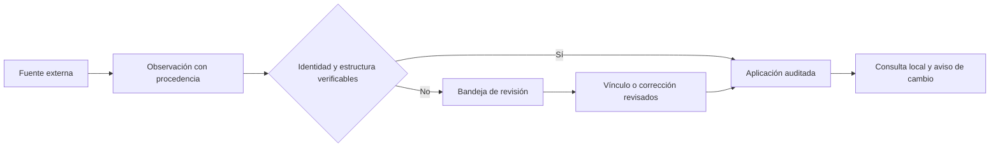

# ONCE · Antes del primer pase ⚽

> **Explicación · 12 minutos.** Entiende el problema, el producto y las decisiones que gobiernan el código. Después entra al [lobby](README.md) o abre la [radiografía técnica](ARCHITECTURE.md).

## 1. El partido que nadie podía reconstruir

Son las ocho de la noche. Un partido acaba de terminar y tres pantallas muestran tres versiones: una lo conserva como programado, otra tiene el marcador final y la tercera mezcla sus puntos con los del torneo anterior. El equipo editorial sabe de fútbol; aun así, persigue nombres, copia escudos y crea temporadas a mano antes de explicar qué pasó.

Esta escena es una **situación ilustrativa del problema que ONCE busca resolver**, no el relato de un cliente ni una pérdida económica medida. El dominio real es el fútbol y el piloto empieza en Colombia.

El caos crece en una secuencia reconocible:

1. Una fuente entrega `Santa Fe`; otra, `Independiente Santa Fe`. Sin identidad común, aparecen dos clubes.
2. El calendario llega como una lista anual. Apertura y Clausura terminan dentro de una clasificación.
3. Un administrador corrige un nombre. La siguiente importación pisa su trabajo.
4. Cada visitante obliga a consultar un servicio externo. La cuota desaparece antes de terminar el día.
5. Se restaura una copia sin detener el trabajador. Una tarea antigua escribe sobre el estado recuperado.

El cuello de botella es transformar información dispersa en información coherente. Una interfaz bonita acelera la consulta; por sí sola no resuelve ninguno de esos cinco problemas.

## 2. La misión: que el administrador sea árbitro

ONCE reúne catálogo, calendario, resultados, participantes, clasificaciones y hechos verificables en una base local. Las fuentes aportan observaciones; las reglas deciden qué puede convertirse en un dato publicado. Los administradores revisan excepciones y corrigen campos concretos.

**Una intervención humana debe mejorar la información, no reemplazar una importación entera.**

| Persona | Antes de ONCE | Trabajo útil dentro de ONCE |
| --- | --- | --- |
| Administrador | Crear equipos, rondas y partidos uno por uno | Elegir cobertura y resolver identidades ambiguas |
| Auditor | Comparar hojas sin saber quién modificó qué | Examinar procedencia, observaciones y cambios por campo |
| Lector | Saltar entre calendarios y fichas desconectadas | Explorar partidos, equipos, competiciones y jugadores |
| Desarrollador | Integraciones que escriben sin un criterio compartido | Un adaptador dentro de una cola, un presupuesto y una transacción |
| Operador | Copiar una carpeta y esperar que arranque | Transferir código, secretos, base y medios mediante pasos comprobables |

La oportunidad de negocio es reducir la operación manual y construir una experiencia confiable alrededor de datos conectados: exploración, contexto editorial y consulta histórica. Suscripciones, una API comercial o servicios para medios son **posibles evoluciones**. El repositorio no implementa facturación, contratos de disponibilidad ni acceso comercial ilimitado a sus fuentes.

## 3. Un dato entra al estadio

La observación es la evidencia de lo recibido. El registro canónico es la identidad que ONCE usa para conectar el dominio. Separarlos permite investigar un error sin presentar la respuesta del proveedor como verdad automática.

Ejemplo: el identificador de una temporada necesita competición y, cuando corresponda, edición. `2024` no es una clave suficiente. Primera A 2024, Primera B 2024 y Apertura 2024 son contextos distintos.

En la importación colombiana comprobada, Primera B 2022 contiene Apertura, Clausura, una final anual `Championship` y una promoción `Promotion Play-offs`. Se conservaron cuatro ediciones. Es una regla contrastada para ese formato, no un permiso para clasificar cualquier ronda desconocida por intuición.

## 4. La frontera entre automatización y confianza

ONCE ofrece pausa, observación y aplicación automática. La pausa tiene efecto operativo sobre las tareas. El trabajador comprueba reservas y cambios de configuración antes de publicar una respuesta descargada.

| Principio | Consecuencia observable |
| --- | --- |
| Identidad antes que similitud | Un nombre parecido puede generar revisión; no obliga a fusionar fichas |
| Desconocido no significa cero | Un marcador ausente sigue siendo desconocido |
| Una edición tiene límites | Tablas y participantes se separan por temporada, fase y grupo |
| La corrección tiene dueño | Los campos protegidos no se reemplazan silenciosamente al sincronizar |
| Publicar requiere trazabilidad | Se conservan observaciones, vínculos externos y auditoría |
| La cuota es compartida | Abrir más pestañas no multiplica las consultas al proveedor |
| Recuperar también es controlar | Una restauración termina con automatización pausada |

Una comprobación de cuenta solicitada explícitamente por un administrador puede consultar el proveedor aunque la automatización esté pausada. Comparte presupuesto y espaciado; no reactiva perfiles. El [manual de automatización](docs/automation.md) explica ese control.

## 5. Metodología sin disfraces

El proyecto usa ideas de DDD para ordenar lenguaje y reglas: competición, edición, fase, grupo, participante y observación tienen responsabilidades distintas. Se expresan en módulos y validaciones. **No se afirma una implementación completa de Clean Architecture, CQRS o event sourcing**: el modelo y varias operaciones usan SQLModel directamente, y las notificaciones complementan una base relacional.

La forma recomendada de desarrollar es una iteración corta con resultado verificable:

1. Describe una situación del dominio: «una tabla no debe mezclar dos ediciones».
2. Conserva un ejemplo mínimo que reproduzca el riesgo.
3. Escribe o ajusta una prueba de regresión donde exista una regla relevante.
4. Cambia el módulo responsable manteniendo el contrato del consumidor.
5. Comprueba PostgreSQL o navegador cuando la frontera lo requiera.
6. Documenta qué cambió, qué evidencia existe y qué continúa pendiente.

Es compatible con Agile y con TDD en cambios de comportamiento. No hay evidencia de una certificación Agile ni de que toda la historia se haya escrito con TDD. Una modificación de texto no necesita una prueba que repita ese texto; una condición de carrera de la cola sí necesita una comprobación significativa.

La arquitectura se gana con decisiones que resisten casos reales. El equipo femenino de un club no debe confundirse con su equipo masculino. Un cambio histórico de identidad exige evidencia. Una tabla que no puede asociarse con seguridad permanece en revisión, aunque publicarla por fuerza haga que el panel parezca más completo.

## 6. Qué está comprobado

Instantánea del **27 de septiembre de 2026**, conservada con sus límites en [el registro de desarrollo](docs/development.md):

| Resultado | Evidencia o límite |
| --- | --- |
| 2.890 encuentros API-Football | Quince calendarios: cinco competiciones por tres años, 2022–2024 |
| 3.091 encuentros totales | Incluye 201 registros anteriores; no todos tienen el mismo origen |
| 35 tablas del proveedor | Una tabla adicional de Clausura B 2023 quedó en revisión de identidad |
| Archivo abierto 2025 | 200 encuentros; 33 resultados ausentes conservados explícitamente |
| Cuenta gratuita comprobada | 100 solicitudes diarias; la fuente rechazó 2026 |
| Detalles de partidos | Incorporación progresiva; no están completos para todos los encuentros |
| Operación | Docker local, copia de PostgreSQL y medios, pruebas y controles administrativos |

Estas cifras describen una instalación. Un clon nuevo comienza con su catálogo inicial y automatización pausada; Git no transporta la base privada del piloto.

## 7. Qué significa «listo para desplegar»

Significa que existen configuración ejecutable, migraciones, validaciones y procedimientos de copia, recuperación y servidor. No significa que ya haya un servidor público, alta disponibilidad, una tasa de respuesta garantizada o derechos ilimitados sobre los escudos.

Para un servicio de producción sostenido hay que elegir dominio, servidor, presupuesto del proveedor, objetivos de recuperación y responsables de operación. No se necesita construir un clúster antes de responder esas preguntas. Se necesita explicar qué pasa cuando el único host deja de estar disponible.

El siguiente paso depende de tu misión:

- **Verlo funcionar:** [README](README.md) → [SETUP](SETUP.md).
- **Entender o ampliar:** [ARCHITECTURE](ARCHITECTURE.md) → [TESTING](TESTING.md).
- **Operarlo:** [DEPLOYMENT](DEPLOYMENT.md) → [TROUBLESHOOTING](TROUBLESHOOTING.md).
- **Contribuir:** [CONTRIBUTING](CONTRIBUTING.md).

## 8. Cómo leer esta colección

La colección aplica [Diátaxis](https://diataxis.fr/): tutoriales para aprender haciendo, guías para resolver tareas, referencias para consultar hechos y explicaciones para comprender decisiones. La ruta anterior es lineal; dentro de cada archivo se identifica cuándo cambia el tipo de contenido. Puedes recorrer el sistema completo o aterrizar directamente en una emergencia sin leer su historia otra vez.
