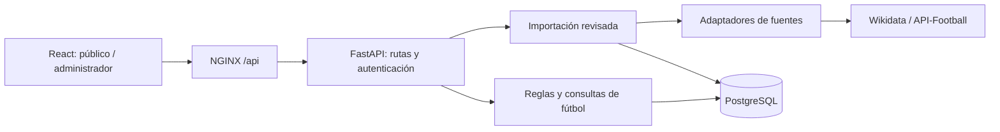

# Arquitectura de ONCE

ONCE usa un **monolito modular**: una API, una base y un frontend, desplegados con Docker Compose. Las responsabilidades se separan en módulos; no hacen falta microservicios para mantener esta instalación. La prioridad es conservar contratos y datos, facilitar cambios y comprobar las reglas de fútbol.

## Flujo y límites

| Módulo | Responsabilidad |
| --- | --- |
| [src/main.py](../src/main.py) | Construir la aplicación, registrar rutas, middleware y arranque. |
| [src/api/dependencies.py](../src/api/dependencies.py) | Sesión de base de datos por petición y autenticación compartida. |
| [src/api/routes](../src/api/routes) | Adaptar HTTP: sesión, lecturas públicas, entidades, contexto, partidos y proveedores. |
| [src/football/rules.py](../src/football/rules.py) | Compatibilidad de equipos y competiciones, sin dependencias HTTP. |
| [src/football/standings.py](../src/football/standings.py) | Calcular clasificaciones a partir de equipos y partidos finalizados. |
| [src/football/queries.py](../src/football/queries.py) | Consultas con relaciones precargadas y proyección de partidos. |
| [src/catalog](../src/catalog) | Colecciones, normalización, revisión y aplicación atómica de datos abiertos. |
| [src/providers](../src/providers) | Transporte externo y sincronización de observaciones. |
| [src/models.py](../src/models.py) | Entidades persistidas y esquemas de lectura/escritura. |
| [migrations](../migrations) | Evolución versionada del esquema; datos históricos conservados. |

SQLModel comparte definiciones entre persistencia y validación. Es una decisión pragmática: todavía no hay una capa de repositorios independiente del ORM. Los casos con reglas propias conservan funciones explícitas; no hay un generador de CRUD que esconda esas reglas. Las rutas de proveedores aún coordinan parte del trabajo de medios; se podrán extraer casos de uso cuando exista otro consumidor.

## Transacciones y consistencia

Cada petición recibe una sesión; cerrar una sesión descarta cambios sin confirmar. Los endpoints de escritura controlan el commit. `save` centraliza únicamente añadir, confirmar y refrescar una entidad; no se utiliza para dividir una importación en varias transacciones.

La ingesta conserva un lote antes de modificar el catálogo, comprueba coincidencias de nuevo al aplicar y usa un bloqueo transaccional en PostgreSQL. Un fallo revierte el lote completo. Los IDs internos sobreviven a cambios de nombres o proveedores. Consulta [ingestion.md](ingestion.md).

Las listas usan `joinedload` para relaciones singulares y `selectinload` para colecciones. La lista administrativa de partidos no carga eventos o alineaciones que su contrato no devuelve. Las pruebas comparan el número de consultas con listas crecientes; para lotes muy grandes SQLAlchemy puede dividir la precarga en bloques.

## Frontend

- `App.jsx` carga de forma diferida el administrador o la experiencia pública. La demo es otra carga opcional.
- `Dashboard.jsx` coordina acceso; `useAdminData` gestiona sesión y lecturas cancelables. `requestGate` invalida respuestas reemplazadas o de una sesión cerrada.
- `AdminWorkspace.jsx` compone las vistas; `admin/forms` contiene editores por entidad. Los valores iniciales y el manejo de mutaciones se comparten.
- `public/routes.js` concentra la conversión entre rutas y entidades. `api.js` centraliza URL, credenciales, cancelación y errores.
- Tokens, tipografía y movimiento viven en `styles`. `index.css` conserva el orden explícito de las capas visuales; el CSS base y las mejoras ONCE siguen separados para preservar la apariencia. No se eliminan selectores por conjetura.

## Contratos y evolución

Las rutas, respuestas y cookie existentes se conservan. La refactorización compara OpenAPI antes/después y ejecuta pruebas funcionales en SQLite, PostgreSQL y navegador. Los nombres internos de Docker están fijados para permitir renombrar la carpeta sin crear una base vacía.

Antes de añadir infraestructura, exige un problema medido: paginación cuando el tamaño de las listas lo requiera; colas cuando se necesiten importaciones programadas; índices tras observar consultas; separación de servicios cuando haya una necesidad de despliegue independiente. Todavía faltan matrículas por temporada, un modelo de federaciones/territorios, reconciliación por campo y trabajos de ingesta en segundo plano. No se presentan como capacidades ya implementadas.
