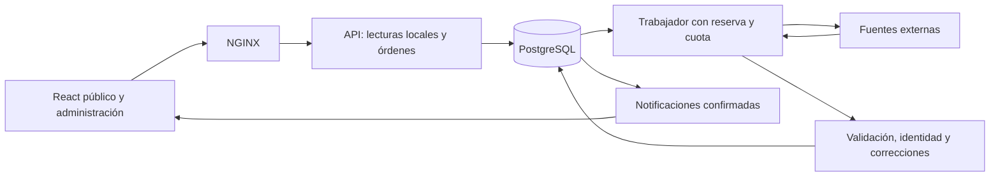

# Arquitectura de ONCE

ONCE conserva un monolito modular: FastAPI, PostgreSQL y React, con un trabajador independiente construido a partir de la misma imagen del backend. Docker Compose ejecuta cuatro servicios de aplicación: base, API, trabajador y frontend/NGINX. La identidad de Compose sigue siendo `vertice` para conservar el volumen existente, aunque el producto y la carpeta se llamen ONCE.

## Flujo de operación

La navegación ordinaria consulta datos locales. Las órdenes de sincronización se guardan en una cola durable; el navegador no mantiene vivo el proceso. Las herramientas explícitas de previsualización e importación revisada siguen disponibles para administradores de fuentes. Una coincidencia de nombre puede abrir una revisión, pero no autoriza una fusión automática.

| Módulo | Responsabilidad |
| --- | --- |
| [src/main.py](../src/main.py) | Composición de rutas, middleware, arranque y recursos locales |
| [src/api/dependencies.py](../src/api/dependencies.py) | Sesiones, actor autenticado y autorización central de rutas protegidas |
| [src/accounts](../src/accounts) | Cuentas nominales, perfiles y revocación de sesiones |
| [src/api/routes/reading.py](../src/api/routes/reading.py) | Lecturas paginadas y filtradas, sesión y salud local |
| [src/football](../src/football) | Compatibilidad deportiva, consultas, participación y clasificaciones |
| [src/audit](../src/audit) | Cambios por campo, versiones, correcciones protegidas e incidencias |
| [src/sync](../src/sync) | Planificación, reservas, cuotas, pausa, recuperación, retención y entrega de cambios |
| [src/providers](../src/providers) | Transporte, adaptación, cobertura, enriquecimiento y archivo abierto |
| [src/catalog](../src/catalog) | Colecciones de identidad y carga abierta revisada |
| [src/control](../src/control) | Inventario de calidad y procedencia del estado actual |
| [src/models.py](../src/models.py) | Entidades deportivas, procedencia, auditoría y proyecciones |
| [migrations](../migrations) | Evolución del esquema conservando identidades y datos |

SQLModel comparte definiciones entre persistencia y validación. No se introduce una capa de repositorios vacía ni servicios distribuidos sin una necesidad medida. El dominio deportivo no hace peticiones HTTP; el caso de uso decide la transacción y el adaptador interpreta la fuente.

## Transacciones, pausa y recuperación

Cada petición recibe una sesión. Los casos de escritura confirman datos, auditoría y notificaciones juntos; cerrar una sesión sin confirmar descarta sus cambios. Las mutaciones manuales identifican al actor. Las correcciones por campo exigen motivo y versión esperada; los proveedores respetan su protección y autoridad.

El trabajador reclama una reserva temporal, descarga fuera de la transacción canónica y vuelve a comprobar estado, versión de control y token de reserva antes de publicar. La pausa persiste en la base. Un trabajo de una versión anterior no puede confirmar datos después de la pausa; una petición HTTP ya iniciada puede terminar. La API informa de la actividad pendiente mientras termina o caduca.

La ejecución puede repetirse después de una caída, con efectos idempotentes: identidades únicas, comparación de campos y observaciones deduplicadas. La cuota se reserva antes de consultar y se ajusta con las cabeceras disponibles. Los errores se clasifican y los reintentos son limitados. El calendario adapta su frecuencia a partidos en vivo, próximos o terminados, con el intervalo configurado y la cuota restante como límites. Los metadatos de liga/equipos se reutilizan durante una ventana de 24 horas; las consultas de marcador no necesitan descargarlos cada vez. El estado operativo y la última comprobación se muestran separados de la frescura deportiva.

Los detalles de un partido mantienen IDs y fuente. Una respuesta vacía, parcial o que omite una fila no demuestra que deba eliminarse: se conserva el dato anterior y se abre revisión cuando corresponde. Una alineación histórica no crea por sí sola una plantilla actual.

La auditoría de cambios rechaza modificaciones/borrados en el ORM y, en PostgreSQL migrado, mediante un disparador. Esto no impide que el propietario de la base modifique su estructura. Las copias y la separación de accesos siguen siendo parte de la operación. Véase [dominio y auditoría](automation/domain-and-audit.md).

## Consultas, tablas y pantalla

Los listados principales tienen paginación, filtros previos al conteo y detalle bajo demanda. Las relaciones singulares se precargan con `joinedload`; las colecciones necesarias, con `selectinload`. Se conserva compatibilidad con rutas anteriores, pero la navegación de las pantallas nuevas usa contratos acotados. Esto evita que abrir la aplicación descargue todos los eventos y alineaciones.

Las clasificaciones ONCE son proyecciones por edición/fase/grupo y versión de regla. Se reconstruyen al cambiar resultados, reglas o ajustes y conservan una huella de entradas. El bloqueo por edición serializa correcciones concurrentes antes de releer los insumos. Las tablas publicadas por un proveedor se guardan y muestran por separado. Una regla no revisada o un ámbito inconsistente no se presenta como una tabla válida.

Las notificaciones se guardan con la transacción del dato. Un publicador asigna su secuencia después de confirmar, evitando perder transacciones que terminaron fuera de orden. SSE permite revalidar los ámbitos visibles; la reconexión fuera de la ventana conservada pide un estado actual. NGINX trata este flujo sin buffering. La conexión de pantalla no retiene una sesión PostgreSQL durante la espera.

La API y el trabajador tienen pools y recursos limitados; el proceso de salud no descarga catálogos. Las imágenes se almacenan por hash en un volumen compartido, con tamaño y contenido comprobados y SVG sanitizado. Los recursos conservan autor, licencia y procedencia.

## Frontend

`App.jsx` carga de forma diferida el administrador o la experiencia pública; la demo sigue separada. `Dashboard.jsx` y `useAdminData` coordinan sesión y lecturas cancelables. Las respuestas sustituidas o de una sesión cerrada se descartan. Los filtros, formularios y rutas mantienen responsabilidades separadas.

La administración ofrece automatización, revisión, historial, reglas y personas según permisos. Mostrar u ocultar botones mejora la experiencia, pero el servidor aplica los permisos a todas las rutas protegidas. Los controles distinguen consulta realizada, cambios publicados, pausa e incidencias; no llaman «en vivo» a una mera petición completada.

## Límites vigentes

No hay una fuente gratuita de directo colombiano continuo acreditada por el mero hecho de instalar el trabajador. API-Football necesita credencial y cobertura de la edición; OpenFootball aporta archivo publicado y Wikidata/Commons, identidad y enriquecimiento. El descubrimiento prepara perfiles de cobertura publicados por la fuente en estado pausado y con acceso pendiente de verificar. Puede elegir ediciones actuales/próximas publicadas o el último archivo disponible; no habilita automáticamente todas las competiciones ni inventa torneos dentro de un año. La instalación local deja de consultar cuando se apaga el equipo o Docker.

El motor de tablas requiere reglas revisadas para cada ámbito. No trae precertificados todos los reglamentos colombianos, tablas de promedios ni criterios deportivos no implementados. Federaciones/organizadores separados, categorías femeninas/juveniles explícitas y aprobación por una segunda persona siguen siendo ampliaciones del modelo. No deben simularse usando confederaciones o fusionando equipos por nombre.

El [manual de automatización](automation.md), el [modelo real](data.md), el [registro de hitos](hitos.md) y los [manuales de traslado](deployment/transfer.md) indican configuración, pruebas y límites operativos. La [propuesta original](proposals/sincronizacion-colombia.md) se conserva como diseño y criterio de aceptación, con una matriz que distingue implementación de cobertura externa pendiente.
