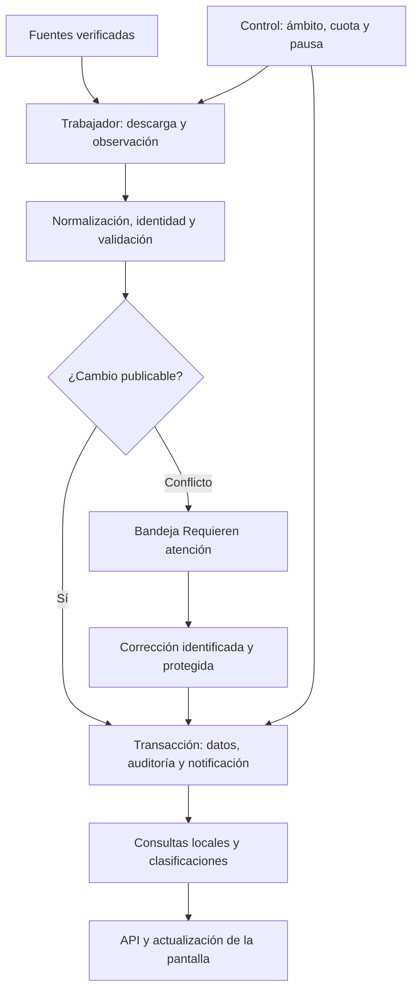

# Automatización de ONCE: piloto colombiano

Estado: **diseño de referencia con implementación inicial incorporada al código**. Actualización: 27 de septiembre de 2026. Decisiones del producto: Docker local, presupuesto inicial de datos de cero y fútbol colombiano primero. La tabla siguiente distingue software disponible, comprobaciones efectuadas y condiciones externas pendientes; las secciones de diseño conservan los objetivos originales y no prueban por sí solas cobertura, certificación deportiva o tiempos de respuesta.

El objetivo es que ONCE descubra, relacione y actualice información de forma automática. Los administradores revisarán excepciones y corregirán campos concretos. La automatización debe conservar los datos existentes, explicar su procedencia, respetar cuotas y recuperarse de interrupciones. No es posible garantizar ausencia absoluta de fallos externos; sí establecer invariantes comprobables para que un fallo no se convierta silenciosamente en información incorrecta.

La [arquitectura vigente](../architecture.md), el [modelo actual](../data.md) y el [control existente](../control-datos.md) describen lo que funciona hoy. El [manual operativo](../automation.md) describe la implementación utilizable. Los [hitos](../hitos.md) separan resultados verificados de condiciones pendientes.

## Situación de implementación

| Área | Código incorporado | Condiciones o límites que permanecen |
| --- | --- | --- |
| Integridad | Identidades externas con contexto; participantes por edición/fase/grupo; estados y marcadores desconocidos | Los vínculos ambiguos requieren revisión; federaciones, organizadores y categorías de género/edad no se modelan como entidades nuevas en esta entrega |
| Auditoría y personas | Versiones, correcciones protegidas, autoridad por campo, historial, perfiles nominales y revocación | No hay aprobación obligatoria por segunda persona ni certificación regulatoria; el propietario de PostgreSQL conserva capacidad administrativa |
| Motor | Trabajador Docker, cola, reservas, cuotas, pausa persistente, reintentos, observaciones e incidencias | Necesita ordenador/Docker activos; cobertura y condiciones del proveedor siguen siendo externas |
| Catálogo y enriquecimiento | Colecciones Wikidata, escudos Commons con caché, hechos históricos estructurados | Una falta de identidad, licencia o dato crea una excepción; no se inventa historia ni se publica un escudo sin condiciones identificadas |
| Calendarios y ediciones | Adaptadores de API-Football y archivo abierto; descubrimiento prepara ámbitos candidatos pausados, y la importación crea datos según la selección verificada | La cobertura publicada no demuestra acceso con la credencial; las ediciones múltiples requieren contexto explícito, sin inventar Apertura/Clausura |
| Clasificaciones | Reglas versionadas, ajustes, proyecciones por ámbito y tabla de la fuente separada | No se certifican reglamentos DIMAYOR por defecto ni se implementan promedios con ventanas históricas incompletas |
| Lecturas y entrega | Paginación/filtros, detalle bajo demanda, índices, pools acotados, cadencia según ventanas deportivas y notificaciones confirmadas SSE | Los objetivos de rendimiento se aceptan mediante mediciones; una API rápida no acredita directo deportivo |
| Recuperación | Respaldo de base/medios, restauración en destino vacío, pausa y cancelación de reservas anteriores | La verificación de hash confirma integridad, no la procedencia de un archivo ajeno |

Se verificaron las invariantes de identidad, correcciones, tablas y permisos en SQLite y PostgreSQL, incluyendo correcciones concurrentes en PostgreSQL. El ensayo de migración con datos heredados confirmó su conservación y no creó matrículas históricas supuestas. Un respaldo binario se restauró en otra base desechable: los cambios auditados, el disparador de solo anexado y los datos sobrevivieron, y la automatización quedó pausada. La suite completa, las mediciones y el despliegue de cada entrega se registran en los [hitos](../hitos.md); no deben deducirse de esos ensayos parciales.

La programación de calendarios adapta el siguiente intervalo al estado y proximidad de los partidos, respetando siempre el intervalo mínimo configurado y el presupuesto compartido. Reutiliza hasta 24 horas los metadatos de liga/equipos y reserva la mayor frecuencia para cambios deportivos. Los perfiles descubiertos nacen pausados y con acceso por verificar; no se activa una competición nueva por publicarse otro año. La existencia de estos mecanismos no demuestra directo colombiano continuo gratuito con una credencial concreta.

## 1. Alcance inicial y fuentes

El piloto propuesto empieza por una edición de la primera división colombiana con cobertura demostrable. Incorporará sus equipos, participantes, fases, partidos, resultados, clasificación y recursos visuales. El catálogo de organizaciones relacionadas podrá enriquecerse antes. Torneo, Copa, fútbol femenino y selecciones se activarán como ámbitos independientes cuando sus fuentes y reglas estén verificadas.

Una competición configurada una vez debe descubrir sus nuevas ediciones y participantes cuando la fuente los publique. El cambio de año no autoriza a inventar una temporada, equipos inscritos, fechas o calendario.

| Información | Fuente propuesta | Condición de uso |
| --- | --- | --- |
| Identidades, relaciones y hechos históricos estructurados | Wikidata | Guardar identificador, referencias, revisión y fecha; comprobar tipo de entidad y contexto |
| Escudos y otros recursos visuales | Wikimedia Commons y fuentes autorizadas | Comprobar condiciones por archivo y conservar autoría, licencia, atribución y enlace de origen |
| Calendarios, resultados y estadísticas | Adaptador de API-Football existente, sujeto a prueba de cobertura | Verificar edición accesible, campos, retraso observado, cuota y condiciones de almacenamiento/publicación |
| Formatos, desempates, sanciones y cambios oficiales | Reglamentos y comunicaciones de DIMAYOR | Fijar versión, vigencia y modificaciones aplicables; su publicación web no demuestra que exista una API de directo |
| Archivo histórico complementario | Conjuntos abiertos con licencia y cobertura verificadas | Incorporar solo los periodos realmente completos; no presentarlos como señal en vivo |

Los datos estructurados de Wikidata se ofrecen bajo CC0. Esto no extiende esa licencia a todos los textos o archivos enlazados. Commons requiere comprobar cada archivo. Véanse [licencias de Wikidata](https://www.wikidata.org/wiki/Wikidata:Licensing) y [reutilización de Commons](https://commons.wikimedia.org/wiki/Commons:Reusing_content_outside_Wikimedia).

API-Football anuncia 100 solicitudes diarias en su plan gratuito y limita las temporadas disponibles. No se ha acreditado en esta revisión el acceso gratuito a una edición colombiana actual mediante una cuenta concreta. Consultar un único endpoint cada 30 segundos durante dos horas consume 240 solicitudes, sin contar plantillas, estadísticas, reintentos ni descubrimiento. Por eso no se promete directo continuo gratuito. [Planes de API-Football](https://www.api-football.com/pricing).

Colombia no figura en las doce competiciones gratuitas publicadas por football-data.org. No se propone como sustituto gratuito verificado para este piloto. [Cobertura de football-data.org](https://www.football-data.org/coverage).

La primera entrega de cobertura será una matriz por competición/edición: calendario, resultados, eventos, alineaciones, estadísticas, tablas, profundidad histórica, frecuencia observada, licencia y cuota. Cada capacidad podrá estar disponible, incompleta o ausente. Si no hay fuente gratuita admisible para la edición actual, se podrá avanzar con catálogo y un archivo histórico cubierto; la pantalla explicará la falta de directo, sin fabricar actualidad.

## 2. Diagnóstico original y reparaciones requeridas

Este fue el diagnóstico anterior a la implementación. Los modelos, auditoría y motor actuales atienden las reparaciones indicadas; las particularidades deportivas y de cobertura continúan sujetas a verificación:

| Situación actual | Consecuencia de ejecutarla periódicamente | Reparación previa |
| --- | --- | --- |
| Un mapping de temporada usa solo el año y es único por proveedor/tipo/ID | Dos ligas de 2026 pueden colisionar; un año externo puede contener dos ediciones locales | Identidad externa con ámbito y selector de consulta separado |
| La matrícula vincula equipo y competición, sin temporada | Una tabla histórica puede incluir participantes de otra edición | Participación explícita por edición |
| Solo existen programado, en vivo y finalizado | Aplazamientos y cancelaciones pierden significado | Estados completos y conservación del código original |
| La sincronización sobrescribe campos y transforma goles ausentes en cero | Una respuesta incompleta degrada el último dato válido | Semántica de ausencia, validación y actualización selectiva |
| El detalle se elimina y recrea por fuente | Respuestas vacías o parciales pueden borrar datos y cambiar IDs | Reconciliación con identidad estable y evidencia de completitud |
| Las correcciones no tienen protección por campo | La siguiente sincronización puede deshacer la intervención humana | Correcciones protegidas, versiones y auditoría |
| Una alineación histórica puede crear una plantilla sin vigencia | Se confunde participación en un partido con pertenencia actual | Separar alineación, inscripción y vínculo temporal |
| La tabla usa un cálculo genérico y participantes permanentes | Se mezclan fases o se aplica un desempate incorrecto | Reglas versionadas y proyecciones por ámbito |
| Importar datos implica HTTP dentro de la solicitud administrativa | Lentitud y recuperación dependiente de una petición web | Trabajo durable ejecutado fuera de la API |

Referencias de implementación revisadas: [modelos](../../src/models.py), [rutas de proveedor](../../src/api/routes/providers.py), [sincronización](../../src/providers/sync.py), [clasificación](../../src/football/standings.py) y [consultas públicas](../../src/api/routes/public.py).

## 3. Arquitectura y responsabilidades

Se conserva el monolito modular FastAPI/PostgreSQL/React. Docker añadirá un trabajador independiente, construido con la misma imagen del backend. La API atenderá consultas y registrará órdenes breves; el trabajador descargará y procesará datos. PostgreSQL conservará trabajos, datos, auditoría y notificaciones pendientes.

Las responsabilidades serán explícitas y se introducirán gradualmente:

- **Proveedores:** autenticación, transporte, límites y traducción del formato externo.
- **Ingesta:** observaciones, normalización, identidad y propuestas de cambio; reutiliza el catálogo existente.
- **Fútbol:** reglas e invariantes de entidades, participación, partidos y clasificación.
- **Sincronización:** programación, cola, intentos, reservas temporales y recuperación.
- **Auditoría:** cambios, correcciones protegidas, incidencias y atribución individual.
- **Consultas:** respuestas paginadas, proyecciones y fechas de actualización para el cliente.

El dominio no hace peticiones de red. Un caso de uso controla la transacción. Las dependencias externas se sustituyen por adaptadores en pruebas. No se añade una plataforma de microservicios, Redis o Kafka al piloto; una necesidad medida justificaría esa decisión posterior.

## 4. Identidades y estructura deportiva

El esquema debe representar estas relaciones sin convertirlas en una única jerarquía universal:

- Organismo internacional, confederación, federación y organizador son entidades o papeles distintos, con relaciones verificadas. No se utilizará «confederación» para guardar cualquier organización.
- Competición → edición/temporada → fases → grupos o llaves → partidos. Las jornadas y rondas pertenecen a un ámbito explícito.
- Equipo → participación en una edición; afiliación institucional, plantilla y alineación de un partido son relaciones distintas.
- Reglas y sanciones → ámbito, vigencia y versión; un cambio de reglamento no reescribe inadvertidamente el histórico.

Un club, una selección y un equipo femenino o juvenil no se fusionan por compartir nombre. Los cambios de nombre conservarán identidad y alias cuando exista evidencia. Los IDs canónicos actuales se mantienen.

El vínculo externo identificará proveedor, tipo, ID y contexto cuando lo requiera la fuente. Por ejemplo, una temporada de proveedor puede requerir competición externa + año; su selector de consulta no será la identidad de la edición ONCE. Si un único año externo contiene dos torneos, la asignación a ediciones/fases necesita un criterio verificado de la fuente. Una coincidencia aproximada de nombres solo crea un candidato para revisión.

La autoridad se definirá por campo y ámbito: identidad institucional, marcador, reglamento e imagen pueden proceder de fuentes distintas. Una fuente de respaldo no sustituye a la principal solo por responder más tarde; debe tener cobertura, versión y prioridad compatibles. Se conservarán las observaciones discrepantes y se abrirá una incidencia cuando no exista una decisión automática justificable.

Las migraciones producirán un informe de vínculos ambiguos. No copiarán los equipos actuales a todas las temporadas anteriores. Los campos existentes cuyo origen no pueda demostrarse se protegerán hasta resolver su propiedad.

### Particularidades colombianas

Una tabla de fase, una clasificación acumulada y una tabla de promedios son productos distintos. Cada uno tendrá participantes, ventana temporal, desempates, sanciones y regla identificados. No se completarán resultados históricos ausentes con ceros. Los promedios solo se habilitarán con cobertura suficiente para la ventana reglamentaria.

Los formatos pueden modificarse durante el año: DIMAYOR anunció el 19 de agosto de 2026 cambios a partido único en octavos y cuartos de Copa, manteniendo el formato de Liga II. Esto exige reglas versionadas y revisión de modificaciones oficiales, no asumir el mismo formato todos los años. [Comunicado oficial](https://dimayor.com.co/2026/08/19/comunicado-oficial-dimayor-informa-decisiones-de-la-asamblea-extraordinaria/).

El calendario de una competición profesional se importa y reconcilia con lo publicado. Generar emparejamientos sería una función distinta para torneos propios. Una fecha desconocida conserva ese estado. Las reglas no conocidas pueden bloquear únicamente el cálculo afectado y crear una incidencia, mientras el resto del catálogo sigue actualizándose.

Se diferenciarán **tabla oficial de la fuente**, **cálculo ONCE** y, cuando se implemente, **proyección provisional en vivo**. Una discrepancia será visible; no se sustituirá silenciosamente una por otra. Los cálculos conservarán versión de entradas y reglamento, con reconstrucción reproducible tras correcciones.

## 5. Contrato del proceso de sincronización

1. El planificador elige trabajo vencido y relevante. Deduplica objetivos y condensa sondeos pendientes del mismo ámbito.
2. El trabajador reclama el trabajo con una transacción breve. La reserva tiene propietario, vencimiento y token creciente; se usa el reloj de PostgreSQL.
3. Se reserva cuota de manera atómica y se vuelve a comprobar el control antes de iniciar una petición. La descarga ocurre fuera de transacciones de dominio.
4. Se registra la observación: fuente, selector, instante deportivo disponible, recepción, versión del adaptador, hash, cobertura y completitud. No se registran credenciales.
5. Se resuelven referencias en lote y se valida estructura, ámbito, coherencia y orden de versiones. Las relaciones ausentes desencadenan trabajos dependientes acotados o una incidencia.
6. Una transacción corta comprueba pausa, versión del control y reserva vigente; aplica diferencias, auditoría, progreso y notificación durable. El cierre del trabajo o del lote forma parte de esa confirmación.
7. Solo después de confirmar se publica la actualización hacia el navegador. Las lecturas normales siguen funcionando si Internet falla.

La cola puede utilizar `FOR UPDATE SKIP LOCKED`, apropiado para repartir trabajos entre consumidores según [PostgreSQL 15](https://www.postgresql.org/docs/15/sql-select.html). Los bloqueos siguen un orden fijo: controles, trabajo y entidades. Un lote grande se divide en unidades con límites, checkpoints y dependencias; nunca en una transacción ilimitada que bloquee la navegación.

La garantía será **ejecución al menos una vez y efectos idempotentes**: repetir una respuesta no duplica entidades, cambios auditados ni cálculos. Un trabajador cuyo token haya vencido no puede publicar. Una caída antes de confirmar permite repetir; una caída posterior se reconoce por la identidad del trabajo y su resultado.

Las respuestas incompletas, vacías sin garantía de cobertura o antiguas no borran datos válidos. Una eliminación o retirada de un evento necesita evidencia y autoridad de la fuente. Un marcador puede disminuir por corrección oficial; no se supondrá crecimiento monotónico. Marcador desconocido, cero real y ausencia del campo tendrán significados distintos. Se comprobará que cada partido pertenezca al ámbito solicitado.

Las observaciones con contenido idéntico se deduplican; los intentos y comprobaciones conservan telemetría compacta. Cambios canónicos, auditoría y progreso son atómicos. La última observación existente seguirá siendo útil como consulta rápida, pero no sustituirá el historial necesario para explicar un cambio.

### Frecuencia y presupuesto

Las siguientes frecuencias son hipótesis configurables, no servicios activados ni promesas de cobertura:

| Información | Cadencia inicial candidata |
| --- | --- |
| Organizaciones, identidad e historia | Días o semanas; revisión adicional si se detecta una modificación |
| Escudos | Al cambiar la referencia o vencer una comprobación espaciada |
| Nuevas ediciones, participantes y calendario lejano | Diaria, con reducción cuando no hay novedades |
| Próximos partidos | Cada 5–15 minutos en ventanas acotadas, si la cuota lo permite |
| Marcador y estado en vivo | Cada 30–60 segundos solo con cobertura y presupuesto demostrados |
| Alineaciones y estadísticas | Según disponibilidad y cambios; presupuesto separado del marcador |
| Partido finalizado | Conciliación posterior y al día siguiente; después controles espaciados |

El planificador calculará consumo estimado antes de activar un perfil. Priorizará partidos relevantes, agrupará consultas cuando la API lo permita y reservará margen para correcciones. Reintentos también consumen presupuesto. No multiplicará consultas por el número de visitantes.

Se respetarán límites diarios y por minuto, cabeceras de cuota, `Retry-After` y pausas de la fuente. Errores transitorios tendrán reintentos limitados con espera creciente y variación aleatoria; errores de autenticación/configuración detendrán el ámbito. Tras fallos repetidos se espaciarán comprobaciones para evitar una tormenta de peticiones. Wikimedia requiere identificación y respeto a sus políticas; los límites serán configurables y revisables. [Acceso](https://www.mediawiki.org/wiki/Wikimedia_APIs/Access_policy) y [límites de Wikimedia](https://www.mediawiki.org/wiki/Wikimedia_APIs/Rate_limits).

## 6. Pausa efectiva y experiencia administrativa

La pantalla principal mostrará **Automatización**, ámbito, última comprobación, último cambio, próxima ejecución, consumo disponible y problemas que requieren acción. El estado operativo distinguirá **Actualizando**, **Al día**, **Pausando**, **Pausado**, **Sin cobertura**, **Con retraso** y **Requiere atención**. «Al día» no se deduce de que haya terminado una petición: requiere cobertura y frescura suficientes para ese dato.

Habrá control global y por competición/tipo de información. Internamente se conservarán modos desactivado, observación y automático. En observación se guardan y comparan respuestas sin modificar el catálogo publicado. Una instalación nueva comenzará pausada hasta configurar y verificar su ámbito.

Al pausar, una transacción persiste la orden y aumenta la versión del control. Toda aplicación de resultados valida esa versión dentro de su propia transacción con bloqueo coordinado. Un cambio que ya terminó antes de confirmarse la pausa permanece; un trabajo con la versión anterior no puede confirmar nuevas escrituras canónicas después. Las peticiones externas ya iniciadas pueden concluir, pero no autorizar cambios obsoletos. Las notificaciones SSE de cambios confirmados antes de la pausa sí pueden terminar de entregarse: la pantalla debe reflejar esos datos válidos.

La interfaz mostrará «Pausando» mientras drena o caduca la actividad y solo después «Pausado». La pausa sobrevive al reinicio de Docker. Reanudar concilia una ventana reciente y trabajos relevantes; no reproduce cada sondeo que se perdió mientras el ordenador estuvo apagado. «Actualizar ahora» utiliza la misma cola, cuotas y permisos y no elude una pausa global.

La bandeja **Requieren atención** agrupará incidencias repetidas por causa y entidad, con filtros por competición, edición, fuente, gravedad y estado. Mostrará el valor publicado, propuesta externa, motivo y efecto de cada decisión. Un administrador puede corregir un campo sin rellenar de nuevo la ficha.

Las correcciones conservarán usuario, motivo, valores anterior/nuevo y versión del registro. Permanecerán protegidas hasta que se elija «Volver a aceptar la fuente». Si llegan nuevos valores mientras tanto, se conservarán como observación y diferencia. Los conflictos entre dos editores se detectarán por versión; una reversión será otro cambio auditado.

La cuenta administrativa actual deberá evolucionar a actores identificables y permisos de lectura, corrección, operación y gestión de fuentes, con un actor de servicio separado. Es compatible con empezar con una sola persona. La auditoría será de solo anexado para la aplicación y con permisos de base separados. Eso no equivale a una certificación ni a inmutabilidad frente a un administrador de PostgreSQL; controles adicionales dependerán de un marco de auditoría concreto.

## 7. Recursos visuales e historia

Cada recurso conservará entidad, procedencia, licencia, autor, créditos, revisión y hash del contenido. Una imagen manual protegida no se sustituye automáticamente. La caché local tendrá tamaño, vigencia y limpieza definidos según las condiciones de la fuente; las descargas usarán destinos permitidos, límites de tamaño y validación de tipo. Los SVG se sanearán o convertirán antes de mostrarlos.

Los archivos se prepararán fuera de la transacción y se publicarán por referencia solo cuando estén completos. Una limpieza recuperará temporales y archivos huérfanos. El volumen de medios y sus metadatos entrarán en el procedimiento de transferencia/restauración.

La presentación conservará el contorno y transparencia originales con tamaños adaptados, espacio reservado y carga diferida. Si falta un archivo utilizable, se mostrará un sustituto discreto; no se inventará un escudo oficial.

La historia empezará como una línea de hechos verificables: fundación, denominaciones, sedes y logros con fuentes y fechas. Un texto narrativo requiere tratamiento separado de licencia y procedencia. No se generarán hechos para rellenar huecos ni se asumirá que un artículo visible puede copiarse íntegro.

## 8. Rendimiento local y actualización de pantalla

### Línea base observada

En la revisión se hicieron ocho lecturas secuenciales por ruta después de un calentamiento, a través de Nginx. No hubo carga concurrente ni sincronización durante la muestra.

| Ruta pública | Mediana | Máximo | Respuesta |
| --- | --- | --- | --- |
| Partidos | 8,7 ms | 16,5 ms | 1.101 B |
| Competiciones | 4,2 ms | 4,4 ms | 1.197 B |
| Equipos | 5,5 ms | 6,1 ms | 8.642 B |
| Jugadores | 3,3 ms | 3,8 ms | 2 B |

La base tenía aproximadamente 9 MB, un partido, veinte equipos, cinco competiciones y cero jugadores. Estas mediciones no demuestran capacidad a escala. El equipo tiene unos 15,8 GiB de RAM y doce hilos lógicos; Docker disponía de unos 7,67 GiB. Una muestra de reposo de los tres contenedores sumó aproximadamente 134 MiB; excluye el coste total de Docker Desktop, su máquina virtual y Windows.

Hoy [PublicApp](../../frontend/src/public/PublicApp.jsx) carga todos los partidos y varios catálogos al entrar; la [ruta pública](../../src/api/routes/public.py) incluye detalles anidados sin paginación. [La carga administrativa](../../frontend/src/admin/useAdminData.js) comprueba sesión descargando partidos y carga seis catálogos. Esos caminos crecerían con toda la base. La optimización prioritaria es limitar trabajo por pantalla.

### Cambios de rendimiento propuestos

1. Listados resumidos y paginados, filtros en servidor, búsqueda acotada y detalle cargado al abrirlo. Comprobación de sesión independiente. Paginación estable por fecha/ID u otro orden definido; documentar el tratamiento de fechas desconocidas y cambios durante la navegación.
2. Precarga de vínculos en lote, comparación por versión/hash y escritura solo de diferencias. Cliente HTTP persistente y concurrencia inicial baja: un trabajador, hasta dos trabajos y una petición simultánea por proveedor, ajustados a sus límites.
3. Clasificación materializada por edición/fase/grupo: reconstruir el ámbito afectado tras un resultado, sanción o cambio de regla. Cada versión publicada será coherente; nunca exponer la mitad de una tabla recalculada.
4. Índices vinculados a consultas reales, verificando planes y coste de escritura. Candidatos: detalle por partido/fuente, calendario por edición/fecha/ID, mapping por identidad local, medios por entidad y cola por estado/próxima ejecución. Revisar índices existentes antes de duplicarlos. Un B-tree no resuelve por sí solo búsquedas de texto con coincidencia intermedia.
5. Pool SQL acotado entre API y trabajador, transacciones cortas y límites de memoria/CPU medidos en Compose. Comprobación de salud ligera en lugar de descargar competiciones cada diez segundos. Mantener durabilidad y autovacuum; no desactivar garantías de escritura para mejorar un benchmark.
6. Caché y ETag por selección y versión. Assets con hash y caché larga, HTML revalidable, compresión de texto/JSON, imágenes dimensionadas. Las respuestas autenticadas no entran en caché pública compartida.
7. Auditoría, observaciones, trabajos y notificaciones con políticas de retención distintas y capacidad vigilada. Cuerpos repetidos se deduplican; el borrado de observaciones respeta licencia, necesidades de reconstrucción y evidencias retenidas. La promesa de replay se limita al periodo efectivamente conservado.

`pg_stat_statements` está disponible pero no activado en esta instalación. Su activación controlada y los planes sobre datos representativos permitirán elegir índices con evidencia. Referencias: [estadísticas de consultas](https://www.postgresql.org/docs/15/pgstatstatements.html) y [uso de EXPLAIN](https://www.postgresql.org/docs/15/using-explain.html).

### Entrega de cambios al navegador

Se propone un canal SSE por aplicación abierta, limitado a los ámbitos visibles. Una notificación durable se escribe junto con el dato; un publicador posterior al commit comunica las entidades/versiones afectadas. El navegador revalida solo lo necesario, agrupa ráfagas y conserva foco, filtros, desplazamiento y animaciones en curso.

El cursor de entrega debe admitir confirmaciones fuera de orden: no se asumirá que un ID secuencial asignado antes del commit representa el orden de publicación. Un publicador serializado podrá asignar la secuencia de entrega a registros ya confirmados, con deduplicación y reentrega tras caídas. Las pruebas incluirán transacciones que confirman en orden inverso.

La reconexión recupera desde el último cursor dentro de la retención; si caducó, se obtiene un estado actual. Un cliente lento no retiene una conexión de base de datos ni una cola ilimitada. `NOTIFY` puede despertar al publicador, pero no sustituye el registro durable. Nginx necesita buffering desactivado para esta ruta y tiempos compatibles con latidos. Referencias: [SSE](https://developer.mozilla.org/en-US/docs/Web/API/Server-sent_events/Using_server-sent_events), [NOTIFY](https://www.postgresql.org/docs/15/sql-notify.html) y [proxy de Nginx](https://nginx.org/en/docs/http/ngx_http_proxy_module.html).

### Objetivos de aceptación, todavía no demostrados

| Indicador | Objetivo inicial del piloto |
| --- | --- |
| Confirmación visual de una interacción | Hasta 100 ms en condiciones de prueba fijadas |
| Lectura local paginada caliente | p95 hasta 150 ms; p99 hasta 400 ms |
| Detalle de partido local caliente | p95 hasta 250 ms |
| Cambio confirmado en la base → pantalla conectada | p95 hasta 1 segundo |
| Escrituras después de confirmar una pausa | Cero nuevas escrituras canónicas de trabajos con versión anterior; pueden entregarse notificaciones de cambios ya confirmados |
| Duplicados canónicos por repetir un lote | Cero |
| Solicitudes por encima de la cuota local configurada | Cero; conciliar el presupuesto con cabeceras y otros consumidores de la misma cuenta |

Se medirán, por separado, arranque en frío, primer render, percentiles, consultas por petición, bytes, CPU/RAM, bloqueos, escritura/WAL, cola y consumo externo. La frescura deportiva depende de publicación de la fuente + intervalo de consulta + procesamiento; una API rápida no elimina el retraso del proveedor. Se distinguirán última comprobación, último cambio e instante deportivo conocido.

La carga se ensayará en Docker aislado, progresando de 10.000 a 100.000 partidos y hasta un millón de eventos sintéticos, con diez lectores concurrentes, un auditor y el trabajador activo. El conjunto reflejará filtros y distribución del piloto; se publicarán duración, recursos y resultados reproducibles. No se extrapolarán las lecturas de la base pequeña a esta carga.

## 9. Migración, recuperación y operación

Las revisiones Alembic serán incrementales: identidades/participación/estados; observaciones/auditoría/correcciones; política/cola/progreso; reglas/proyecciones; notificaciones. Cada revisión conservará IDs y se probará sobre una copia desechable. La nueva ingesta se habilitará por ámbito después de reconciliar anomalías previas.

Antes de migrar la instalación se verificará una copia restaurable. Se mantendrá la identidad actual de Compose y su volumen; el nombre visible ONCE no justifica crear una base vacía. La puesta en marcha del worker exige que la migración haya terminado correctamente. La API y el worker de una entrega deben compartir contratos compatibles.

Un problema del proveedor dejará accesible el último dato válido y mostrará su antigüedad. Se recogerán métricas y logs con identificador de trabajo, ámbito y causa, sin secretos. Las incidencias repetidas se agruparán; no se generará una alerta o commit por cada sondeo.

Docker local necesita que el ordenador y el motor estén encendidos. Al dormir o apagar el equipo, la sincronización se detiene. Al volver, se recupera trabajo relevante con límites. Servicio continuo las 24 horas requeriría posteriormente un equipo siempre disponible, utilizando los mismos contenedores y manuales.

El despliegue documentará: configuración de fuentes, límites, activación, pausa, recuperación de trabajos, agotamiento de cuota, copia/restauración de base y medios, cambio de equipo y actualización del software. La reversión puede requerir una corrección hacia adelante; nunca se restaurará a ciegas una copia antigua sobre correcciones recientes. Se ensayará recuperación antes de declarar el hito operativo.

## 10. Hitos y condiciones de avance

Los hitos siguientes conservan sus **condiciones de aceptación originales**. La matriz inicial y el [registro de hitos](../hitos.md) indican qué se implementó y verificó. Disponer del motor H2 no demuestra la cobertura de H0, los reglamentos colombianos de H4 ni todos los objetivos de H5. Las mejoras de lectura y operación pueden avanzar sin esperar al directo.

| Hito | Entrega | Condición para avanzar |
| --- | --- | --- |
| H0 · Cobertura y línea base | Matriz colombiana por edición/fuente, presupuesto y escenario de rendimiento | Fuente/periodo verificables, condiciones registradas y capacidad prevista compatible con la cuota |
| H1 · Integridad y correcciones | Identidades con ámbito, participantes por edición, estados, auditoría y campos protegidos | Migración ensayada; sin colisión de temporadas; una corrección sobrevive a nuevos lotes |
| H2 · Motor controlable | Cola durable, límites, pausa persistente, intentos y recuperación en Docker | Pausa durante HTTP y caída/reinicio superan pruebas sin duplicar ni publicar resultados obsoletos |
| H3 · Catálogo y calendario automáticos | Descubrimiento de ediciones/equipos/relaciones, medios e historia verificable | Primero observación; después autoaplicación acotada con excepciones explicables y cuotas respetadas |
| H4 · Tablas colombianas | Reglas versionadas, fases/grupos, resultados y conciliación | Casos oficiales fijados reproducidos; ámbitos aislados; cobertura histórica suficiente para cada cálculo |
| H5 · Actualización continua y rendimiento | Cadencia adaptativa, consultas acotadas y pantalla actualizada por cambios | Cobertura de directo y presupuesto demostrados; objetivos medidos con ingesta activa |
| H6 · Operación transferible | Manuales, pruebas de fallos y ensayo de restauración/traslado | Recuperación reproducible y evidencias enlazadas en el registro de hitos |

Cada hito incluirá problema, decisión de arquitectura, contratos/migraciones, pruebas relevantes, mediciones cuando corresponda, límites conocidos y operación/recuperación. Se marcará «verificado» solo con evidencias. Las entregas de código se agruparán por cambios coherentes y probados; los datos sincronizados, secretos y copias no se publican en Git. El mecanismo de CI seguirá documentado en el [manual de GitHub](../deployment/github.md).

### Pruebas decisivas

- Dos competiciones del mismo año y dos ediciones de una misma fuente no colisionan ni mezclan participantes.
- Repetir cien veces un lote no duplica registros ni auditoría de cambios inexistentes.
- Dos trabajadores, una reserva vencida y una caída antes/después del commit conservan efectos correctos.
- Pausar durante una descarga impide nuevas escrituras canónicas de ese trabajo; las notificaciones de cambios previamente confirmados se entregan y reiniciar Docker mantiene la pausa.
- Una respuesta parcial, vacía no concluyente o desordenada conserva el último dato bueno; una corrección oficial sí puede rectificarlo con evidencia.
- Aplazamiento, cancelación, fecha desconocida y marcador desconocido no inventan resultados.
- Correcciones humanas y detalles manuales sobreviven; las ediciones concurrentes detectan conflicto.
- Una alineación antigua no altera la plantilla actual; una matrícula histórica requiere evidencia temporal.
- Clasificaciones y desempates coinciden con casos de la versión oficial fijada; resultados y sanciones corregidos reconstruyen el ámbito afectado.
- Cuota agotada, error 429/5xx, pérdida de Internet y cola acumulada no bloquean la navegación ni causan reintentos ilimitados.
- Reconexión SSE, cursor caducado, commits fuera de orden y cliente lento no pierden el estado final ni agotan conexiones.
- Copia/restauración reproduce datos, correcciones, configuración y referencias a medios; nunca se ensaya sobre la base de trabajo.

No se habilitará automáticamente un ámbito nuevo por superar otro sus pruebas. Cada competición y capacidad tiene su propia cobertura, reglas y presupuesto.
